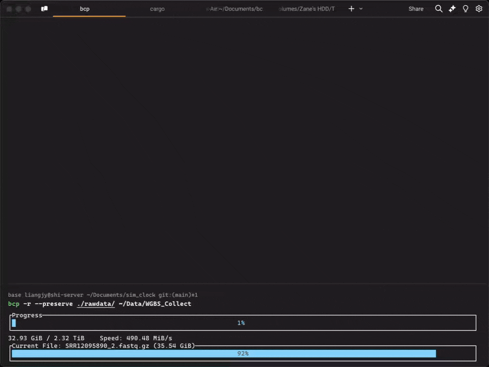

# BCMR (Better Copy Move Remove)

[English](README.md) | [鸿蒙特供版](README_zh.md)

Making file operations simpler and more modern! BCMR is a command-line tool written in Rust that lets you elegantly copy, move, and remove files.



## Installation

### Using Homebrew

```bash
brew tap Bengerthelorf/tap
brew install bcmr
```

### Using Install Script

```bash
curl -fsSL https://raw.githubusercontent.com/Bengerthelorf/bcmr/main/install.sh | bash
```

### Using Cargo

```bash
cargo install bcmr
```

### Building from Source

```bash
git clone https://github.com/Bengerthelorf/bcmr
cd bcmr
cargo build --release
```

The compiled binary will be available at `target/release/bcmr`.

## Detailed Usage Guide

### Shell Integration

BCMR provides flexible shell integration similar to zoxide. You can customize command names with prefixes or replace native commands.

Basic syntax:

```bash
bcmr init [shell] [options]
```

Available options:

- `--cmd <prefix>`: Set command prefix (e.g., 'b' creates bcp, bmv, brm)
- `--no-cmd`: Don't create command aliases
- `--path <path>`: Add directory to PATH

Examples:

```bash
# Add to your ~/.bashrc or ~/.zshrc:
# Use custom prefix (creates testcp, testmv, testrm)
eval "$(bcmr init zsh --cmd test)"

# Replace native commands (creates cp, mv, rm)
eval "$(bcmr init zsh --cmd '')"

# Use 'b' prefix (creates bcp, bmv, brm)
eval "$(bcmr init bash --cmd b)"
```

Supported shells:

- Bash
- Zsh
- Fish

### Copy Command (Copy)

Basic syntax:

```bash
bcmr copy [OPTIONS] <SOURCES>... <DESTINATION>
```

Arguments:

```bash
  <SOURCES>...   Source files/directories
  <DESTINATION>  Target directory
```

Options:

- `-r, --recursive`: Recursively copy directories
- `-p, --preserve`: Preserve file attributes
- `-f, --force`: Overwrite existing files
- `-y, --yes`: Skip overwrite confirmation
- `-e, --exclude <PATTERN>`: Exclude files/directories matching regex
- `-t, --tui`: Use plain text mode
- `-V, --verify`: Verify file integrity after copy
- `-C, --resume`: Resume interrupted copy (Size + Mtime check)
- `-s, --strict`: Use strict hash verification for resume
- `-a, --append`: Append to existing file (ignores mtime/hash)
- `-n, --dry-run`: Dry run (no changes)
- `-h, --help`: Print help information

Examples:

```bash
# Copy a single file
bcmr copy document.txt backup/

# Copy multiple files (Shell Globbing supported!)
bcmr copy *.txt *.md backup/

# Recursively copy a directory
bcmr copy -r projects/ backup/

# Dry run (Preview what will be copied)
bcmr copy -r -n projects/ backup/

# Copy with attribute preservation
bcmr copy --preserve important.conf /etc/

# Force overwrite without prompting
bcmr copy -f -y source.txt destination.txt

# Copy with Regex exclusions (exclude .git folder and .tmp files)
bcmr copy -r --exclude="\.git","\.tmp$" src/ dest/

# Copy with verification
bcmr copy --verify critical_data.db /backup/
```

### Move Command (Move)

Basic syntax:

```bash
bcmr move [options] <source>... <destination>
```

Available options:

- `-r, --recursive`: Recursively move directories
- `-p, --preserve`: Preserve file attributes
- `-f, --force`: Force overwrite existing files
- `-y, --yes`: Skip overwrite confirmation
- `-n, --dry-run`: Preview operation without making changes
- `-e, --exclude=<pattern>`: Exclude matching files (Regex)
- `-t, --tui`: Use plain text mode
- `-V, --verify`: Verify file integrity after move
- `-C, --resume`: Resume interrupted move (cross-device fallback only)
- `-s, --strict`: Use strict hash verification for resume
- `-a, --append`: Append to existing file (ignores mtime/hash)

Examples:

```bash
# Move a single file
bcmr move old_file.txt new_location/

# Move multiple files
bcmr move file1.txt file2.txt new_location/

# Recursively move a directory
bcmr move -r old_project/ new_location/

# Dry run
bcmr move -n old_project/ new_location/

# Move with exclusions (Regex)
bcmr move -r --exclude="^node_modules","\.log$" project/ new_place/
```

### Remove Command (Remove)

Basic syntax:

```bash
bcmr remove [options] <path>...
```

Available options:

- `-r, --recursive`: Recursively remove directories
- `-f, --force`: Force removal without confirmation
- `-i, --interactive`: Prompt before each removal
- `-v, --verbose`: Show detailed removal process
- `-d, --dir`: Remove empty directories
- `-n, --dry-run`: Preview operation without making changes
- `-e, --exclude=<pattern>`: Exclude matching files (Regex)
- `-t, --tui`: Use plain text mode

Examples:

```bash
# Remove a single file
bcmr remove unnecessary.txt

# Remove multiple files (Globbing)
bcmr remove *.log

# Recursively remove a directory
bcmr remove -r old_project/

# Dry run (safe check)
bcmr remove -r -n potentially_important_folder/

# Interactive removal of multiple files
bcmr remove -i file1.txt file2.txt file3.txt

# Remove with exclusions (Regex)
bcmr remove -r --exclude="\.important$","\.backup$" trash/
```

### Progress Display Modes

BCMR provides two progress display modes:

**fancy mode (Default)** and **plain text mode** (enable with `--tui` or `-t`).

#### Configuration

You can fully customize the progress bar by creating a configuration file at `~/.config/bcmr/config.toml`:

```toml
[progress]
style = "fancy"          # "fancy" (default), "plain" (same as --tui)

[progress.theme]
# Define progress bar gradient (Hex colors) - Default is a Morandi purple gradient
bar_gradient = ["#CABBE9", "#7E6EAC"] 
bar_complete_char = "█"
bar_incomplete_char = "░"
text_color = "reset"     # "reset" (default), "black", "red", "green", "yellow", "blue", "magenta", "cyan", "white", or Hex "#RRGGBB"
border_color = "#9E8BCA"
title_color = "#9E8BCA"

[progress.layout]
box_style = "rounded"    # "rounded" (default), "double", "heavy", "single"
```

## License

GPL-3.0 © [Zane Leong](https://github.com/Bengerthelorf)
