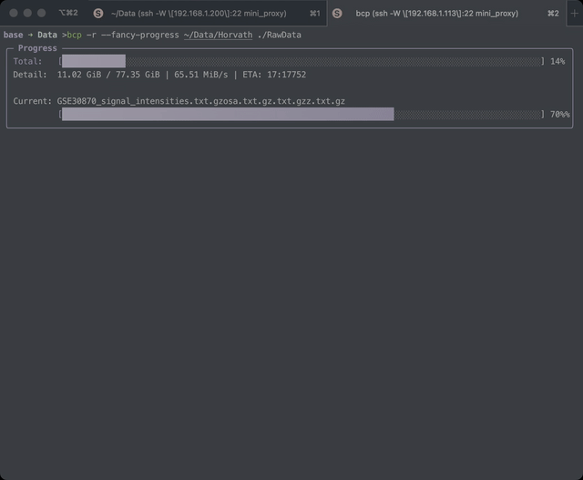

# 🚀 BCMR (Better Copy Move Remove)

[English](README.md) | [中文](README_zh.md)

让文件操作更简单、更现代！BCMR 是一个用 Rust 编写的命令行工具，它让你能以优雅的方式复制、移动和删除文件。



## 📥 安装

### 使用安装脚本 (国内推荐)

使用 `ghfast` 代理加速下载：

```bash
curl -fsSL https://ghfast.top/https://raw.githubusercontent.com/Bengerthelorf/bcmr/main/install_cn.sh | bash
```

### 使用 Cargo

```bash
cargo install bcmr
```

### 源码编译

```bash
git clone https://github.com/Bengerthelorf/bcmr
cd bcmr
cargo build --release
```

编译后的二进制文件位于 `target/release/bcmr`。

## ✨ 特性

- 🎯- **进度条**:
  - **默认**: 现代化的 TUI 盒子界面，含渐变色和详细统计。
  - **TUI 模式**: 使用 `--tui` 或 `-t` 开启经典的行内三行显示模式。
- **高性能**: 优化的缓冲区大小和并行 I/O。🔄 递归目录操作 - 一条命令处理整个文件夹
- 🎨 属性保留 - 保留时间戳、权限等信息
- ⚡ 异步 I/O - 更快的文件操作
- 🛡️ 安全确认机制 - 防止意外覆盖或删除
- 🎭 正则筛选排除 - 使用正则表达式灵活忽略不需要的文件
- 🔍 Dry Run 模式 - 预览操作而不实际执行
- 📊 详细操作信息 - 清楚了解正在发生什么
- 🔌 Shell 集成 - 使用灵活的前缀自定义命令名称
- 🎮 两种进度显示模式 - 纯文本（默认）或华丽的 TUI 显示

## 📖 详细使用指南

### Shell 集成

BCMR 提供类似 zoxide 的灵活 Shell 集成。你可以使用前缀自定义命令名称，甚至替换原生命令。

基本语法：

```bash
bcmr init [shell] [options]
```

可用选项：

- `--cmd <prefix>`: 设置命令前缀 (例如 'b' 会创建 bcp, bmv, brm)
- `--no-cmd`: 不创建命令别名
- `--path <path>`: 将目录添加到 PATH

示例：

```bash
# 添加到你的 ~/.bashrc 或 ~/.zshrc:
# 使用自定义前缀 (创建 testcp, testmv, testrm)
eval "$(bcmr init zsh --cmd test)"

# 替换原生命令 (创建 cp, mv, rm)
eval "$(bcmr init zsh --cmd '')"

# 使用 'b' 前缀 (创建 bcp, bmv, brm)
eval "$(bcmr init bash --cmd b)"
```

支持的 Shell:

- Bash
- Zsh
- Fish

### Copy 命令 (复制)

基本语法：

```baUsage: bcmr copy [OPTIONS] <SOURCES>... <DESTINATION>

Arguments:
  <SOURCES>...   源文件/目录
  <DESTINATION>  目标目录

Options:
  -r, --recursive            递归复制目录
  -p, --preserve             保留文件属性
  -f, --force                覆盖已存在的文件
  -y, --yes                  跳过覆盖确认
  -e, --exclude <PATTERN>    排除匹配正则的文件/目录
  -t, --tui                  开启行内 TUI 模式 (经典显示)
  -n, --dry-run              试运行 (不产生更改)
  -h, --help                 打印帮助信息
```

示例：

```bash
# 复制单个文件
bcmr copy document.txt backup/

# 复制多个文件 (支持 Shell 通配符!)
bcmr copy *.txt *.md backup/

# 递归复制目录
bcmr copy -r projects/ backup/

# Dry run (预览将要被复制的内容)
bcmr copy -r -n projects/ backup/

# 保留属性复制
bcmr copy --preserve important.conf /etc/

# 强制覆盖且不提示
bcmr copy -f -y source.txt destination.txt

# 使用正则排除复制 (排除 .git 文件夹和 .tmp 文件)
bcmr copy -r --exclude="\.git","\.tmp$" src/ dest/
```

### Move 命令 (移动)

基本语法：

```bash
bcmr move [options] <source>... <destination>
```

可用选项：

- `-r, --recursive`: 递归移动目录
- `--preserve`: 保留文件属性
- `-f, --force`: 强制覆盖现有文件
- `-y, --yes`: 跳过覆盖确认
- `-n, --dry-run`: 预览操作而不进行实际更改
- `--exclude=<pattern>`: 排除匹配正则表达式的文件
- `--tui`: 使用经典的行内进度显示 (默认为华丽 TUI 盒子)

示例：

```bash
# 移动单个文件
bcmr move old_file.txt new_location/

# 移动多个文件
bcmr move file1.txt file2.txt new_location/

# 递归移动目录
bcmr move -r old_project/ new_location/

# Dry run
bcmr move -n old_project/ new_location/

# 使用正则排除移动
bcmr move -r --exclude="^node_modules","\.log$" project/ new_place/
```

### Remove 命令 (删除)

基本语法：

```bash
bcmr remove [options] <path>...
```

可用选项：

- `-r, --recursive`: 递归删除目录
- `-f, --force`: 强制删除且不确认
- `-i, --interactive`: 删除每个文件前进行提示
- `-v, --verbose`: 显示详细删除过程
- `-d`: 删除空目录
- `-n, --dry-run`: 预览操作而不进行实际更改
- `--exclude=<pattern>`: 排除匹配正则表达式的文件
- `--tui`: 使用经典的行内进度显示 (默认为华丽 TUI 盒子)

示例：

```bash
# 删除单个文件
bcmr remove unnecessary.txt

# 删除多个文件 (通配符)
bcmr remove *.log

# 递归删除目录
bcmr remove -r old_project/

# Dry run (安全检查)
bcmr remove -r -n potentially_important_folder/

# 交互式删除多个文件
bcmr remove -i file1.txt file2.txt file3.txt

# 使用正则排除删除
bcmr remove -r --exclude="\.important$","\.backup$" trash/
```

### 进度显示模式

BCMR 提供两种进度显示模式：

1. **华丽 TUI 模式 (默认)**: 具有增强视觉元素和渐变的丰富终端 UI。
2. **经典 TUI 模式**: 简单的行内文本进度条 (使用 `--tui` 或 `-t` 开启)。

#### 华丽模式配置

你可以通过创建配置文件 `~/.config/bcmr/config.toml` 来完全自定义华丽进度条：

```toml
[progress]
# 默认华丽模式的样式设置
style = "fancy"

[progress.theme]
# 定义进度条渐变 (十六进制颜色) - 默认为莫兰迪紫色渐变
bar_gradient = ["#CABBE9", "#7E6EAC"] 
bar_complete_char = "█"
bar_incomplete_char = "░"
text_color = "reset"       # "reset" 适应你的终端背景
border_color = "#9E8BCA"
title_color = "#9E8BCA"

[progress.layout]
# 选项: rounded (圆角), double (双线), heavy (粗线), single (单线)
box_style = "rounded"
```

默认模式将使用这些设置以获得更佳的视觉体验。

## 📝 许可证

GPL-3.0 © [Zane Leong](https://github.com/Bengerthelorf)
