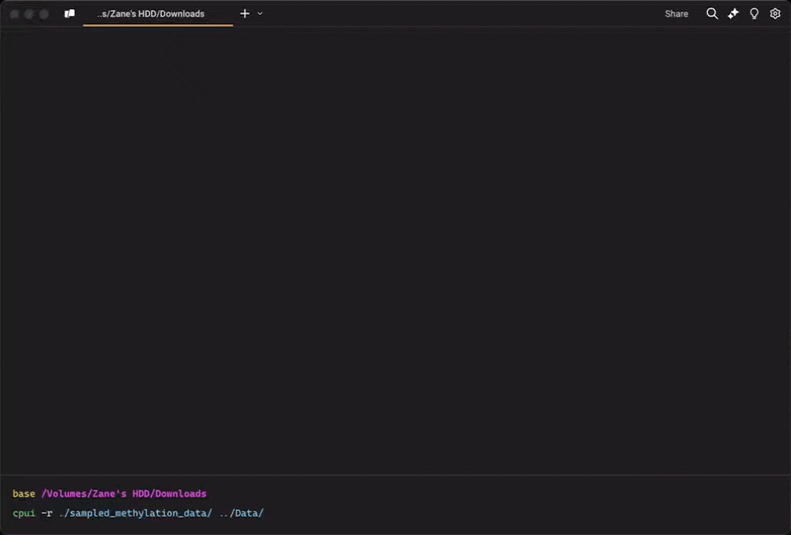

<div align="center">


# BCMR

**更好的复制、移动、删除 — 现代化、安全的文件操作 CLI 工具，支持进度显示、断点续传和远程复制。**

[](https://crates.io/crates/bcmr)
&nbsp;
[](https://app.snaix.homes/bcmr/zh/)
&nbsp;
[](https://github.com/Bengerthelorf/bcmr#安装)

[English](README.md)

<br>



<br>

### [📖 阅读完整文档 →](https://app.snaix.homes/bcmr/zh/)

安装、Shell 集成、CLI 参考、配置等。

</div>

---

## 项目定位

bcmr 是 **`cp` / `mv` / `rm` / `scp` 的现代替代**，**不是 rsync 的替代**。具体来说：

- **单文件复制**（本地或 SSH 远程）：对比 cp 和 scp 有优势 — inline BLAKE3 完整性校验、$\mathcal{O}(1)$ resume 校验、原子化崩溃安全写入、线路层 Zstd/LZ4 压缩。
- **多文件复制** (`bcmr copy -r`)：在"很多小文件"场景下与 cp/rsync 持平或更快（已测量）；单个大文件场景下比 cp 慢约 1.6 倍。
- **它不是什么**：delta-sync 工具。bcmr 的内容寻址去重按 **整块 4 MiB** 匹配 — 对"重复上传同一个 artifact"可靠，对"100 GB 文件里只改了 3 MB"毫无用处。rsync 的 rolling-checksum 解决后者，我们不解决。
- **对标 `rsync -a` 的元数据完整性**：部分支持。mode、mtime、xattr 已保留；ACL、BSD 文件标志位、硬链接图谱尚未。

相关测量见 [技术内幕](https://app.snaix.homes/bcmr/ablation/) 页面。

---

## 亮点

- 📊 **进度显示** — 精美 TUI 界面，渐变进度条、ETA、速度、逐文件追踪。也提供纯文本模式
- 🔄 **断点续传与校验** — 基于会话文件的崩溃安全续传，O(1) 尾块验证。BLAKE3 内联哈希，2-pass 验证复制
- 🌐 **远程复制 (SSH)** — 通过 SSH 上传下载。双端安装 bcmr 时使用二进制 `bcmr serve` 协议加速传输，自动回退至传统 SCP
- 🗜️ **线路压缩** — `--compress={auto,zstd,lz4,none}`：每块 Zstd / LZ4 在握手时协商，源码类文本可节约 ~5× 带宽，对不可压缩的块自动跳过
- 🧠 **内容寻址去重** — ≥ 16 MiB 的上传先交换块哈希，服务端只索取本地 CAS 里没有的块。`BCMR_CAS_CAP_MB` 通过 LRU 限制磁盘占用
- ⚡ **默认并行** — `-j/--jobs` 本地多文件并发（默认 `min(CPU, 8)`）；`-P/--parallel` 独立 SSH 连接；reflink (CoW)、`copy_file_range`、`clonefile` 等内核快速路径
- 🏷️ **属性保留** — `-p` 同时保留权限、mtime 和扩展属性 (Linux + macOS)
- 🛡️ **安全操作** — 干运行预览、覆盖提示、正则排除、原子写入与持久 fsync (macOS 使用 `F_FULLFSYNC`)
- 🤖 **AI Agent 友好** — `--json` 会脱离终端转入后台，进度写入 `~/.local/share/bcmr/jobs/<id>.jsonl`；`bcmr status <id>` 分类为 `scanning`/`running`/`done`/`failed`/`interrupted`
- 🎨 **可配置** — 通过 TOML 自定义颜色渐变、进度条字符、边框样式

## 安装

### Homebrew (macOS / Linux)

```bash
brew install Bengerthelorf/tap/bcmr
```

### 安装脚本

```bash
curl -fsSL https://app.snaix.homes/bcmr/install | bash
```

### Cargo

```bash
cargo install bcmr
```

### 预编译二进制

从 [Releases](https://github.com/Bengerthelorf/bcmr/releases/latest) 下载 — 支持 Linux (x86_64/ARM64)、macOS (Intel/Apple Silicon)、Windows (x86_64/ARM64) 和 FreeBSD。

### 从源码构建

```bash
git clone https://github.com/Bengerthelorf/bcmr.git
cd bcmr
cargo build --release
```

## 快速上手

```bash
# 复制文件
bcmr copy document.txt backup/
bcmr copy -r projects/ backup/

# 移动文件
bcmr move old_file.txt new_location/
bcmr move -r old_project/ new_location/

# 删除文件
bcmr remove -r old_project/
bcmr remove -i file1.txt file2.txt    # 交互式

# 干运行 — 预览但不执行
bcmr copy -r -n projects/ backup/

# 断点续传
bcmr copy -C large_file.iso /backup/

# SSH 远程复制
bcmr copy local.txt user@host:/remote/
bcmr copy user@host:/remote/file.txt ./

# 并行 SCP 传输（4 个工作线程）
bcmr copy -P 4 *.bin user@host:/backup/
bcmr copy -P 8 -r project/ user@host:/backup/

# 对比源与目标差异
bcmr check -r src/ dst/

# JSON 输出（适用于 AI Agent / 脚本）
bcmr copy --json -r src/ dst/         # NDJSON 流式进度
bcmr check --json -r src/ dst/        # 结构化差异输出
```

### Shell 集成

```bash
# 添加到 ~/.zshrc 或 ~/.bashrc:
eval "$(bcmr init zsh --cmd b)"    # 创建 bcp, bmv, brm

# 或替换原生命令:
eval "$(bcmr init zsh --cmd '')"   # 创建 cp, mv, rm
```

> **需要帮助？** 查看 [快速开始](https://app.snaix.homes/bcmr/zh/guide/getting-started) 指南，或浏览完整 [文档](https://app.snaix.homes/bcmr/zh/)。

## 配置

创建 `~/.config/bcmr/config.toml`：

```toml
[progress]
style = "fancy"

[progress.theme]
bar_gradient = ["#CABBE9", "#7E6EAC"]
bar_complete_char = "█"
bar_incomplete_char = "░"
border_color = "#9E8BCA"

[progress.layout]
box_style = "rounded"    # "rounded", "double", "heavy", "single"

[copy]
reflink = "auto"         # "auto" 或 "never"
sparse = "auto"          # "auto" 或 "never"

[scp]
parallel_transfers = 4   # 默认并行 SCP 工作线程数
compression = "auto"     # "auto"、"force" 或 "off"

update_check = "off"     # "off"（默认，不访问网络）、"quiet" 或 "notify"
```

## 贡献

欢迎提交 Issue 和 PR！请访问 [GitHub Issues](https://github.com/Bengerthelorf/bcmr/issues)。

## 技术借鉴与致谢

bcmr 站在这些项目的肩膀上 — 它们定义了"SSH 上的文件传输"该有的样子：

- **[mscp](https://github.com/upa/mscp)**（GPL-3.0）— 并行 SSH 连接
  的思路，使得 `bcmr serve --parallel N` 能够突破 scp 的单流加密
  天花板（详见[实验 19](https://app.snaix.homes/bcmr/zh/ablation/wire-protocol)）。
  bcmr 的实现是这一概念在 Rust 中的**独立重写**，**不是衍生作品** —
  没有复制任何代码，只借鉴了架构思路（开 N 条独立 SSH 会话、把文件
  分散到各连接上）。版权法保护"表达"而非"算法/思想"（17 USC 102(b)
  和其他司法辖区的类似条款），所以我们的 Apache-2.0 许可证不受影响。
- **[HPN-SSH](https://www.psc.edu/hpn-ssh-home/)** — 扩大接收窗口和
  NONE cipher 补丁，最早指出了标准 OpenSSH 数据通路的单核加密瓶颈。
  bcmr 不依赖 HPN 补丁，但"SSH 单流加密是天花板"这个诊断来自他们。
- **`cp` / `mv` / `rm` / `rsync` / `scp`** — 我们 benchmark 的对标
  对象，也是我们想追上并赢过的 UX 标准。`docs/ablation` 的实验章节
  列出了我们在哪些场景下赢、哪些场景下输、哪些场景下打平。

## 许可证

Apache-2.0 © [Zane Leong](https://github.com/Bengerthelorf)
