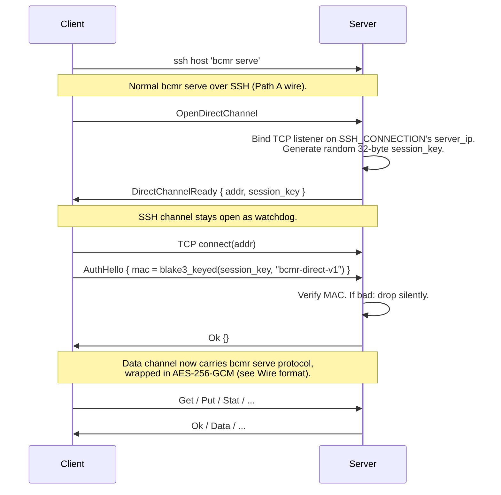

# Direct-TCP Transport Design

Branch: `path-b/direct-tcp`. Not on `main`. Will merge when the design
is reviewed and an end-to-end benchmark justifies it.

The SSH transport caps a single connection at one cipher stream, which
is one crypto core. On modern x86 that's ~500 MB/s of OpenSSH chacha20
regardless of how fat the pipe or how fast the disks are. Path A
(parallel SSH) sidesteps this by opening N connections in parallel.
This document covers the orthogonal approach: keep SSH for
authentication and control, but move the bulk data over a separate TCP
socket whose crypto we control.

## Scope

- **In scope**: single bulk transport that outperforms SSH on a single
  connection, authenticated from the SSH session, with confidentiality
  against a passive network attacker.
- **Out of scope (v1)**: multi-core parallel AEAD (new wire format, v2);
  kernel TLS offload; client-reachability tricks for NAT-ed servers
  (bastion → fallback to Path A); splice(2) zero-copy on the TCP
  socket (v2 optimisation for 25+ GbE links).

## Threat model

Path B targets three deployment shapes in bcmr's real usage:

1. LAN (trusted network, e.g. lab workstation ↔ lab server in the
   same VLAN).
2. Mesh overlay (Tailscale / WireGuard / similar — link layer already
   encrypted, source IPs in CGNAT-like ranges).
3. Public-internet direct (SSH reaches a cloud VM on its public IP;
   data channel would ride the same public path).

A v1 default that's safe for all three cases means **always encrypt
the data plane**. Leaving confidentiality to the link layer works for
(1) and (2) but fails hard on (3), which is a normal bcmr deployment.
Users who know they're on (1) or (2) and want to skip AEAD for raw
throughput can pass `--direct=plain` explicitly.

Attacker capabilities we defend against:

- **Passive eavesdropper** on the data path: AEAD confidentiality.
- **Active tamper** of data frames: Poly1305 integrity + AES-GCM
  authentication. Any bit flip aborts the session.
- **Replay** of captured auth frames: the session key and listener
  are one-shot — a single TCP accept burns both. See *One-shot
  listener* below.
- **Blind port scanner** hitting the loopback or exposed data port:
  AuthHello is required as the first frame; wrong MAC → socket
  closes silently without informing the prober.

Explicitly out-of-scope threats:

- **Active MITM rewriting auth frames**: the MAC binds to the
  session key delivered over SSH, which the MITM can't see. Not a
  concern under our assumption that SSH is intact.
- **Downgrade via RST**: an attacker who can RST the data socket can
  force fallback to Path A. That's an availability attack, not a
  confidentiality one, and Path A's security is intact. Documented
  limitation.
- **Compromised server process**: an attacker with shell on the
  server can already run bcmr directly. Nothing new.

## Rendezvous



### Addr selection

Binding comes from `$SSH_CONNECTION` (set by sshd):

```
SSH_CONNECTION=<client_ip> <client_port> <server_ip> <server_port>
```

The `server_ip` is by definition an interface the client just
connected to successfully — reachable from the client's network
position regardless of NAT, Tailscale, or public routing. Server
binds `server_ip:0`; kernel picks a free port; addr goes back in
`DirectChannelReady`.

Fallbacks:

- `$SSH_CONNECTION` not set → `bcmr serve` was invoked outside sshd
  (e.g. `run_listen` standalone). Refuse direct-TCP; require
  explicit `--listen-addr`.
- Bind fails (server_ip isn't locally assigned, e.g. load-balancer
  terminating SSH) → return Error to client; client falls back to
  Path A with a stderr warning.

Binding to `0.0.0.0` is deliberately not the default. Even with the
one-shot listener, broadcasting the port to every NIC widens the
blind-probe surface for no gain.

### One-shot listener

Each `OpenDirectChannel` creates its own listener and its own session
key. The listener's spawned task accepts exactly one TCP connection,
then drops the listener. AuthHello outcome doesn't matter for this
lifecycle — the whole rendezvous is consumed on the first accept,
success or failure. If AuthHello fails the client retries with a
fresh `OpenDirectChannel`.

Why strict "one accept": treating AuthHello-fail as "try again"
would let a scanner spam connections against a stable listener, and
once the scanner happens to win the accept race it's pinned the
legitimate client out. With strict one-shot, a losing scanner burns
the listener but the legitimate client notices the broken session,
requests a new rendezvous with a new key, and retries. The attacker
has to win every race in a row to deny service indefinitely.

### Session lifetime

Listener join handles are held by the enclosing SSH session.
Session end (SSH disconnect, bcmr serve exit, explicit close)
aborts all live listeners. Prevents the "leak one listener per
request" failure mode and gives the watchdog guarantee the design
implies.

## Wire format

On the TCP socket after AuthHello succeeds, every frame is
AES-256-GCM wrapped:

```
[4B LE total_len][ciphertext][16B Poly1305 tag]
```

`total_len` covers ciphertext + tag. The nonce is not on the wire —
both sides derive it from a per-direction u64 counter. Nonce
layout (12 bytes for AES-GCM):

```
byte 0     : direction flag (0x01 = client→server, 0x02 = server→client)
bytes 1..9 : u64 counter, little-endian
bytes 9..12: zero padding (reserved)
```

The direction byte prevents nonce collision when both endpoints'
counters start at 0 under the same session key. Each sender
increments its own counter per frame; each receiver maintains a
matching counter. A dropped, duplicated, or reordered frame desyncs
the counters and the next tag check fails — session aborts. This is
the intended failure mode: tamper or protocol bug fails loudly, not
silently.

Counter overflow at 2⁶⁴ frames is rejected explicitly. The session
ends before reaching it in any realistic workload (4 MiB frames ×
2⁶⁴ = 64 ZiB) but handling it cleanly documents the limit.

## Modes

```
--direct=aead    (default when --direct is passed)
--direct=plain   (opt-in, requires known-trusted link)
```

The default is AEAD because bcmr users include cloud-VM public-IP
deployments where plain would leak everything. `--direct=plain`
exists for the small subset of users who know their link is already
encrypted (WireGuard mesh, dedicated LAN segment) and want raw
throughput on 25+ GbE hardware where userspace AES starts to show
up in microbenches.

Measured throughput context (single core, `crypto_probe.rs`):

| Hardware              | AES-256-GCM | 10 GbE NIC | 25 GbE NIC |
|-----------------------|------------:|-----------:|-----------:|
| Apple Silicon (idle)  | 5.1 GB/s    | 1.25 GB/s  | 3.1 GB/s   |
| Xeon (load 67)        | 1.5 GB/s    | 1.25 GB/s  | 3.1 GB/s   |

On 1/10 GbE, the NIC is the bottleneck, not crypto — AEAD matches
splice in wall time. On 25/40/100 GbE the crypto starts to matter;
that's where `--direct=plain` + (future) splice-to-TCP wins.

## Capability negotiation

Two new cap bits drive Path B:

```
CAP_DIRECT_TCP = 0x20      // client/server support rendezvous
CAP_AEAD       = 0x40      // post-Welcome framing wraps each frame
                           //   in AES-256-GCM (direct-TCP only)
```

`CAP_DIRECT_TCP` gates `OpenDirectChannel`: if either side lacks the
bit, server rejects with an Error. `CAP_AEAD` only makes sense when a
session key is available; the server masks it off on SSH and raw
`--listen` transports so an unwitting client can't negotiate an
encrypted frame format the server can't honor.

Both caps take effect at the same handshake boundary: the Hello /
Welcome exchange on the data plane happens in plain framing; every
byte after Welcome is AEAD if `effective_caps & CAP_AEAD != 0` and
both sides flip their state machines in lockstep.

No silent fallback: if the caller asks for `--direct` and the server
can't negotiate it, the transfer fails with a clear error rather
than quietly downgrading to SSH.

## Code organisation

```
src/core/framing.rs
    enum Framing { Plain, Aead(AeadState) }       // server-side: one per session
    struct SendHalf, RecvHalf                     // client-side: split so a
                                                  //   pipelined writer task can
                                                  //   own the send counter while
                                                  //   the reader task keeps the
                                                  //   recv counter

src/core/protocol_aead.rs
    key_from_bytes, encrypt_message, decrypt_message,
    read_encrypted_message, write_encrypted_message   // low-level primitives

src/core/transport/ssh.rs
    SshSpawn   (child + stdin + stdout, current behaviour)

src/commands/serve.rs
    handle_open_direct_channel → run_rendezvous → run_direct_session
    run_session (plain + AEAD via &mut Framing)

src/core/serve_client.rs
    ServeClient { transport, reader, writer, tx, rx, ... }
    promote_to_direct_tcp (SSH handshake → OpenDirectChannel →
                           TcpStream → AuthHello → AEAD handshake)
```

`ServeClient` holds `Box<dyn ProtocolChannel + Send>`. Handlers take
`&mut dyn ProtocolChannel`. Splice fast path uses an escape hatch on
the trait (`fn raw_stdout_fd(&self) -> Option<RawFd> { None }`) —
`SshChannel` returns `Some(STDOUT_FILENO)` when it owns the real
stdout, everyone else returns `None` and the handler takes the
buffered path.

AEAD as a decorator (rather than its own transport) means any
channel can be wrapped: future experiments with SSH-over-AEAD or
direct-TCP-plain are the same decorator stacked differently.

## Open questions

- **splice-to-TCP**: `splice(file → pipe) + splice(pipe → socket)`
  is well-established (nginx, HAProxy). Not v1 scope, but the trait
  design already accommodates it — the escape hatch returns a
  writable fd when appropriate. Real users on 25+ GbE will motivate
  this.
- **Multi-core AEAD**: needs a new wire format with nonces on the
  wire (current format has nonces implicit). Will be a new message
  type (`DataChunked { nonce, ciphertext }`) that coexists with the
  current single-core Data frame, not a replacement. v2.
- **Key rotation within a session**: not v1. 2⁶⁴ nonces per session
  key is unreachable; no practical need.
- **`direct=plain` over public internet**: not exposed as a flag
  today. The server refuses any direct-TCP session without CAP_AEAD
  (downgrade-attack guard — see below). If a future workload really
  wants plaintext on a trusted LAN, reinstate a separate `direct=plain`
  flag that flips the server-side guard off, clearly gated behind the
  explicit user choice.
- **SSH ProxyJump**: the server binds the rendezvous listener on
  the IP from `$SSH_CONNECTION`'s `server_ip` field — the interface
  the inbound SSH session actually arrived on. When SSH uses
  `ProxyJump` to reach a host across subnets, that IP is routable
  from the jump host but not from the client. The direct-TCP dial
  then times out, and bcmr's fast-path fallback kicks in (with a
  visible warning, not a silent downgrade). Resolving this properly
  would mean tunnelling the data TCP through the same jump — not
  v1 scope. Users who hit this can stay on `--direct=ssh`.

## Downgrade-attack guard

The Hello/Welcome handshake on the data plane runs in plain framing
so both peers can see the caps byte and decide on AEAD before flipping.
That's a small window where an on-path attacker could, in principle,
strip `CAP_AEAD` from a real client's Hello (or the server's Welcome)
and drive both sides to intersect on zero — silent downgrade to
plaintext on a session the user asked to be encrypted.

Guard: server refuses to proceed past Welcome on a rendezvous-backed
session whose effective caps lack `CAP_AEAD`. Client mirrors the same
check on its side when it has a session key. Stripping the bit is
therefore a hard failure, not a silent downgrade.

`serve_direct_tcp_refuses_session_without_aead` exercises this path.
