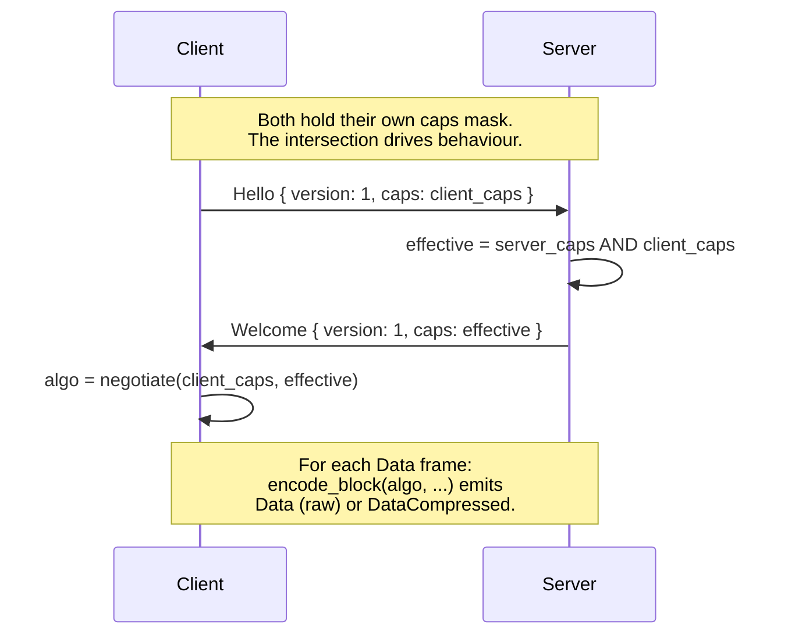
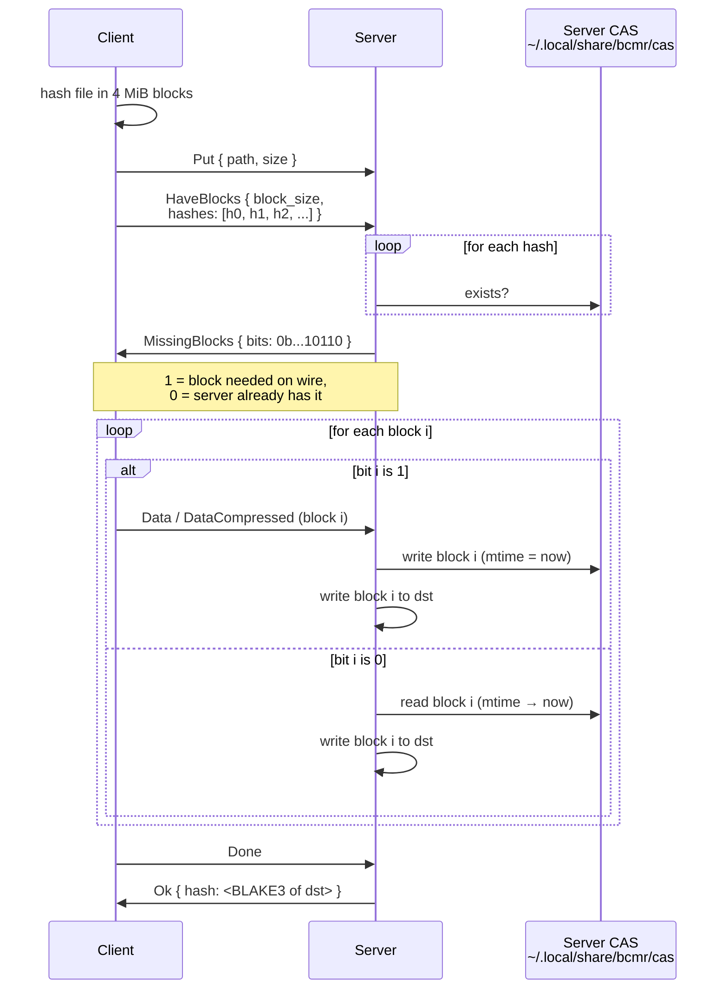
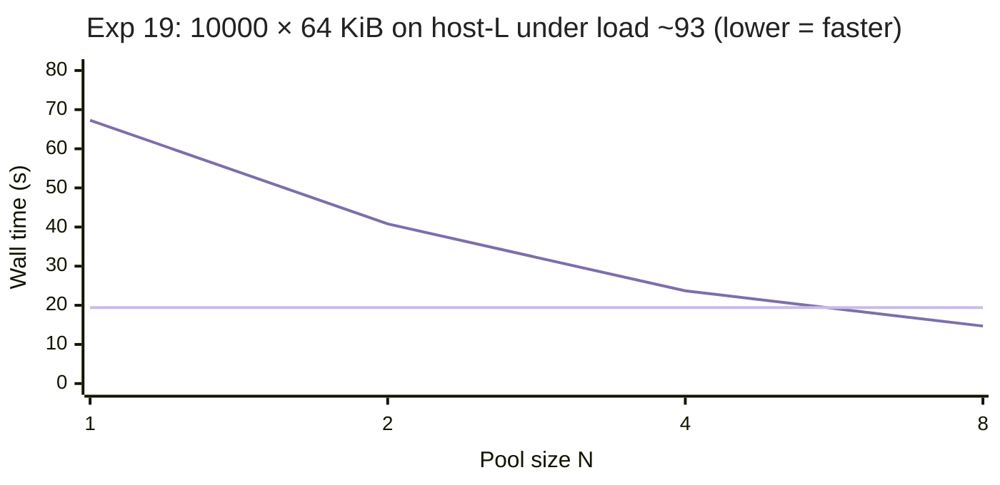

# Wire Protocol & Remote Transfers

::: info Test peers
The cross-host measurements on this page use three SSH peers,
referred to by codename throughout. Network paths and CPUs are
described where relevant; identifying details are intentionally
omitted.

| Codename | Class | Notes |
|----------|-------|-------|
| host-L | Linux server | x86_64, AVX-512, NVMe ext4, kernel 6.x |
| host-M | Linux server | x86_64, AVX-512, NVMe ext4, kernel 5.x |
| host-N | macOS desktop | arm64 M-series, APFS |
:::

For remote transfers, bcmr implements a binary frame protocol
(`bcmr serve`) that replaces per-file SSH process spawning with a
persistent connection over stdin/stdout. The protocol uses
length-prefixed frames (`[4B length][1B type][payload]`) and supports:
`Stat`, `List`, `Hash`, `Get`, `Put`, `Mkdir`, `Resume`, plus the
extensions covered on this page.

Key properties of the base design:
- **Single connection**: all operations multiplexed over one SSH
  session, eliminating $\mathcal{O}(n)$ process spawns for $n$ files.
- **Server-side hashing**: the remote bcmr computes BLAKE3 hashes
  locally, avoiding data round-trips for verification.
- **Automatic fallback**: if the remote does not have bcmr
  installed, transfers silently fall back to legacy SCP.
- **Frame size limit**: `read_message` rejects frames $> 16$ MiB to
  prevent memory exhaustion from malicious peers.

The Hello / Welcome handshake carries an optional trailing
**capabilities byte** (LZ4 = `0x01`, Zstd = `0x02`, Dedup = `0x04`,
Fast = `0x08`). Old decoders read `version` and stop; new decoders
read `caps` too. Talking to a peer that doesn't advertise a bit
just means the feature stays off, so no protocol version bump is
needed for backward-compatible additions.

When **both** peers advertise CAP_ZSTD it wins; if only one does,
LZ4 (if both have it) is the fallback; otherwise raw `Data`. The
encoder also runs a per-block auto-skip: if `compressed.len()`
exceeds 95 % of the original (random / already-compressed bytes)
the block goes raw to save the receiver's decompress pass.

### Parallel SSH with Independent Connections

SSH's `ControlMaster` multiplexing serializes all channels through
one TCP connection and one encryption context. For $P$ parallel
workers, throughput is bounded by a single core's encryption speed
regardless of $P$.

bcmr assigns each parallel worker its own `ControlPath`, creating
$P$ independent TCP connections:

$$\text{throughput} \approx \min(P \cdot T_{\text{single}},\; T_{\text{link}})$$

The [mscp project](https://github.com/upa/mscp) measured 5.98x
speedup with 8 independent connections on a 100 Gbps link.

See the [Remote Copy guide](/guide/remote-copy#serve-protocol-accelerated-transfers)
for end-user configuration.

---

## Experiment 9: Wire Compression for Data Frames

**Hypothesis**: Per-block LZ4/Zstd encoding pays for itself whenever
the network is slower than the codec. On modern CPUs LZ4 decodes at
multiple GB/s, so the receiver is never compute-bound; the only
question is ratio.

**Method (Part A --- codec probe)**: encode then decode a single 4 MiB
block three times (random, text-like, mixed) for each algorithm.
Ratios and throughputs measured on Apple Silicon:

| Workload | Algo     | Ratio | Enc MB/s | Dec MB/s |
|----------|----------|------:|---------:|---------:|
| random   | LZ4      | 1.004 |   3578.2 |  17330.5 |
| random   | Zstd-1   | 1.000 |   4769.9 |  33692.0 |
| random   | Zstd-3   | 1.000 |   4655.3 |  33635.0 |
| random   | Zstd-9   | 1.000 |   2442.8 |  31432.3 |
| text     | LZ4      | 0.390 |    472.8 |   1526.7 |
| text     | Zstd-1   | 0.210 |    301.2 |    871.9 |
| text     | **Zstd-3** | **0.198** | **320.5** |   1012.1 |
| text     | Zstd-9   | 0.180 |     47.2 |   1130.9 |
| mixed    | LZ4      | 0.697 |    863.4 |   2875.6 |
| mixed    | Zstd-3   | 0.599 |    457.2 |   1971.9 |

**Interpretation**:

1. **Random data**. All three codecs return ratios indistinguishable
   from 1.0. Sending compressed is pure CPU waste, so the wire path
   must auto-skip when the encode output is within 5 % of the input.
2. **Text-like data**. Zstd-3 reaches 5x reduction at 320 MB/s encode.
   For anything under ~2.5 Gbps of effective network throughput,
   compression is the bandwidth bottleneck, not the CPU.
3. **Zstd-9** is consistently worse than -3 for file content: encode
   drops by 7x (to 47 MB/s) for only a ~2 % ratio gain. Skip it.

**Decision**: Default to auto-negotiation advertising both LZ4 and
Zstd. The handshake picks Zstd when both sides speak it (better
ratio at acceptable encode cost), falls back to LZ4 when only one
does, and to raw Data frames otherwise. Zstd level fixed at 3 ---
the library's own default, and our measurement agrees.

**Method (Part B --- auto-skip in vivo)**: a unit test encodes a 4 MiB
pseudo-random block through `encode_block(Lz4, ...)` and asserts the
emitted message type is `Data` (raw), not `DataCompressed`. Covers
the happy path where the codec's frame header + payload overshoots
the 0.95 × original threshold and the encoder falls back.

## Experiment 11: Content-Addressed Dedup for Repeat PUT

**Hypothesis**: For dev workflows where the same artifact is
uploaded to a remote host repeatedly, the second-and-onward upload
can avoid the wire entirely if the receiver remembers what it has
seen. BLAKE3 is already computed per 4 MiB block, so a tiny
pre-flight that exchanges hashes lets the server short-circuit to a
local CAS read.

**Design**: Negotiate `CAP_DEDUP` in the Hello/Welcome caps byte.
When active and the file is at least 16 MiB:

The composite hash returned in `Ok` covers the full file regardless
of which blocks took which path. The 16 MiB threshold protects
small uploads from the round-trip cost of HaveBlocks/MissingBlocks
itself.

**Method**: 64 MiB pseudo-random file uploaded twice from a macOS
laptop to **host-L** (Linux NVMe over the public internet, ~30 ms
RTT, ~10 MB/s effective WAN bandwidth). Cold cache via
`rm -rf ~/.local/share/bcmr/cas` between runs.

| Run | Wall (s) | Notes |
|-----|---------:|-------|
| 1 (cold cache) | 18.96 | full 64 MiB on the wire |
| 2 (warm cache) | 12.93 | every block a CAS hit; ~6 s saved |

The savings track the eliminated wire bytes: 64 MiB at ~10 MB/s ≈
6 s, which matches the observed delta. The remaining 13 s is local
hash + CAS read + dst write + protocol round trips, all on either
side of the network. For higher-bandwidth links the relative win
shrinks; for slower / metered ones (cellular tethering, transoceanic
SSH) it grows.

**Correctness check**: SHA-256 of source matches both destinations
across the two runs.

::: info CAS Eviction
Today the CAS grows monotonically. Manual cleanup with
`rm -rf ~/.local/share/bcmr/cas` works but is easy to forget. A
size-capped LRU is on the [Open Questions](/ablation/open-questions)
list.
:::

## CAP_FAST: Skip Server Hash + Linux Splice

`--fast` advertises `CAP_FAST` in the client's caps byte. When the
server also has it (it always does on supported platforms),
GET responses skip the inline BLAKE3 entirely and on Linux the
file → stdout payload moves through `splice(2)` with no userspace
buffer. The server's `Ok` carries `hash: None`; clients that need
end-to-end integrity get it via `-V` (re-hash dst client-side).

The 4 MiB pipe buffer (set via `fcntl(F_SETPIPE_SZ)`) means each
chunk needs one `splice` call from the file and one from the pipe
to stdout, with no copy ever touching userspace. Compression is
mutually exclusive with this path --- the encoder needs userspace
bytes --- so `CAP_FAST` only activates the splice variant when
`--compress=none`. CAP_FAST without splice (compression on, or
non-Linux) still wins from skipping the server's BLAKE3.

## Experiment 14: CAP_FAST Real Numbers

**Hypothesis**: Skipping the server-side BLAKE3 should always be
a small win (server CPU saved) and on Linux the additional
`splice(2)` zero-copy on the file → stdout payload should be a
larger win when the network isn't the bottleneck.

**Method (WAN)**: 1 GiB random file pulled from host-L over a
~10 MB/s residential link. Default vs `--fast`, both with
`--compress=none` so the codec doesn't dominate.

| Mode | Mean (s) | Notes |
|------|---------:|-------|
| default | 157.79 | full BLAKE3 + buffered frames |
| `--fast` | 147.35 | hash skipped, splice on Linux |

**Result**: 1.07x. The wire is the bottleneck; saving ~700 ms of
server-side hash on top of ~150 s of network is noise.

**Method (loopback)**: same file, but `bcmr copy localhost:src
dst` running on host-L itself. SSH-encrypted localhost peaks
around ~500 MB/s on AES-NI hardware so this isolates server
behaviour from real-network jitter.

| Mode | Mean (s) | Throughput |
|------|---------:|-----------:|
| default | 4.43 | ~230 MB/s |
| `--fast` | 5.69 | ~180 MB/s |

**Result**: `--fast` is *slower*. Two compounding causes:

1. **Pipe sizing falls back silently.** `fcntl(F_SETPIPE_SZ, 4 MiB)`
   needs root or a raised `/proc/sys/fs/pipe-max-size`; the
   default cap on Ubuntu is 1 MiB. The call silently caps at the
   max and the actual buffer stays small (default 64 KiB), so each
   4 MiB chunk needs ~64 paired splice rounds.
2. **`spawn_blocking` per chunk.** The splice loop currently lives
   in its own `tokio::task::spawn_blocking` per chunk --- the same
   anti-pattern that
   [Experiment 13](/ablation/local-perf#experiment-13-one-spawn-blocking-for-the-whole-loop)
   identified for the local copy path. With 256 chunks per 1 GiB
   that's 256 thread bounces, more than enough to wipe out the
   savings from skipping hash and memcpy.

**Decision**: Keep `--fast` for the hash-skip benefit. The splice
path stays in; the per-chunk `spawn_blocking` + pipe-sizing fixes
are tracked on the [Open Questions](/ablation/open-questions)
page and land in later releases.

## Experiment 15: CAS LRU Eviction Under Load

**Hypothesis**: A monotonically-growing CAS makes dedup unusable on
disk-constrained boxes. A simple LRU-by-mtime scheme should keep
the store at the configured cap while preserving the most recently
hit blocks (which are also the most likely to recur).

**Method**: end-to-end integration test with three distinct
24 MiB files (each = 6 blocks) PUT in sequence to a local serve
process, with `BCMR_CAS_CAP_MB=32` (=8 blocks). Cap is enforced
on the server side at the start of each PUT. After all three
uploads the CAS is walked and totals are checked.

| What | Expected | Measured |
|------|---------:|---------:|
| Cumulative bytes if no eviction | 72 MiB | --- |
| Cap | 32 MiB | --- |
| CAS bytes after 3rd PUT | $\leq$ 32 MiB | $\leq$ 32 MiB ✓ |
| CAS blob count after 3rd PUT | $\leq$ 8 | $\leq$ 8 ✓ |

The mtime touch on `cas::write` and `cas::read` means a block hit
during PUT N+1 stays warmer than untouched blocks from PUT N,
matching the dev-loop pattern (re-upload the same artifact).

**Decision**: ship the LRU as default. The hit rate degrades
gracefully as cap shrinks, and the `BCMR_CAS_CAP_MB=0` escape
hatch restores the v0.5.8 unbounded behaviour for users who
explicitly want it.

## Experiment 12: Wire Compression Across Real Hosts

The earlier Experiment 9 measured codec ratios in isolation; this
one re-runs the protocol over real SSH connections to confirm the
prediction. 64 MiB of source-text-like content from host-N to
three peers, three runs each.

| Peer | None (s) | LZ4 (s) | Zstd (s) | Zstd vs None |
|------|---------:|--------:|---------:|-------------:|
| host-L (WAN, ~10 MB/s, kernel 6.x) | 18.18 | 10.22 | 3.25 | **5.59x** |
| host-M (WAN, ~10 MB/s, kernel 5.x) | 8.14 | 4.36 | 3.28 | 2.48x |
| host-N (LAN, gigabit, macOS arm64) | 9.58 | 3.26 | 1.82 | 5.28x |

Zstd-3 wins on every link. LZ4 wins over None but loses to Zstd
because the bandwidth saving from Zstd's extra ratio more than pays
for the lower encode throughput. host-M's smaller relative win
comes from the path's variance dominating the small absolute
duration --- the absolute saving is similar to the others.

---

## Experiment 17: Per-File fsync as the Many-Files Tax

**Hypothesis**: bcmr serve was 7.86× slower than `scp -r` on a
10000 × 64 KiB benchmark on host-L loopback. `--fast` and
default were both at ~24 s while scp finished in 3 s. The CPU
breakdown (~3 s total CPU on a 24 s wall) ruled out compute.
Likely culprit: per-file `fdatasync` in both directions ---
server `handle_put` calls `file.sync_all()` per file, client
GET callback calls `dst_file.sync_all()` per file. At ~1-2 ms
per fdatasync × 10000 files, that's 10-20 s of pure barrier
time — matching the gap.

cp/rsync/scp don't fsync per file by default. The local
copy path in bcmr already gates fsync on `--sync` (see
[Experiment 7](/ablation/local-perf#experiment-7-per-file-durability-cost)).
The serve path was over-promising durability silently.

**Method**: 10000 × 64 KiB random files, host-L
loopback ssh (Ubuntu 22.04, NVMe ext4, kernel 6.8). Warm
cache, hyperfine, 2 runs each.

| Command | Mean (s) | vs scp |
|---------|---------:|-------:|
| `scp -r` | 3.11 | 1.00x |
| `bcmr copy -r` (v0.5.13, before) | 24.75 | 7.96x slower |
| `bcmr copy -r` (after, default) | **6.35** | **2.04x slower** |
| `bcmr copy -r --sync` (after) | 15.46 | 4.97x slower |

**Implementation**: New `CAP_SYNC = 0x10` advertised by
server; client OR's it into Hello caps when `--sync` is set.
Both sides gate their per-file fsync on the negotiated bit.
Default is off, matching cp/scp/local-copy default behavior.

**Decision**: Ship. Closes the many-files gap from 7.96x →
2.04x with no functionality loss — `--sync` users still get
exactly the durability they asked for (and pay the 5x cost
they implicitly opted into).

**The single-file path also benefits** — the GET fsync at
end-of-file was ~0.5 s on a 1 GiB stream:

| Command | Before | After |
|---------|-------:|------:|
| `bcmr copy --fast localhost:src dst` | 5.35 s | 4.85 s |
| `bcmr copy localhost:src dst` (default) | 8.27 s | 5.13 s |

---

## Experiment 18: Client-Side Request Pipelining

**Hypothesis**: After Experiment 17 (CAP_SYNC) closed the per-file
fsync overhead, host-L still showed bcmr serve at 2.04× scp on
the 10000 × 64 KiB many-files bench. CPU breakdown ruled out
hash/encode work — the wall time was dominated by RTT-style
serialization. The single-file `put()` does
`send Put → send Data* → send Done → await Ok`, then the next
file. Server's dispatch loop is FIFO and would happily process
queued requests, but the client never queues more than one. SFTP
(what `scp -r` uses under the hood) keeps a window of ~64
in-flight requests; that's the gap.

**Method**: Same 10000 × 64 KiB host-L loopback bench, plus the
mirror upload direction and a single-1-GiB regression check.
Three runs each, hyperfine, warm cache.

| Workload | scp | bcmr (post-Phase-0) | bcmr (post-Phase-1) | bcmr ratio vs scp |
|----------|----:|--------------------:|--------------------:|---------------------:|
| 10000 × 64 KiB DOWNLOAD | 3.02 s | 6.35 s | **3.58 s** | **1.18×** |
| 10000 × 64 KiB UPLOAD   | 3.10 s | ~6.4 s (est) | **3.67 s** | **1.18×** |
| 1 GiB single (`--fast`) | 2.41 s | 4.85 s | 4.61 s | 1.91× |
| 1 GiB single default    | 2.41 s | 5.13 s | 5.05 s | 2.09× |

**Implementation**: Two new methods on `ServeClient`:

- `pipelined_put_files(files, on_complete)`: takes ownership of
  `stdin`, spawns a writer task that emits `Put / Data* / Done`
  for every file in order. The reader task (the caller's task)
  collects FIFO `Ok` hashes from `stdout`.
- `pipelined_get_files(files, sync, on_complete)`: mirror — the
  writer task sends every `Get` request up-front, the reader
  demuxes the `Data* / Ok` stream into per-file dst handles.

The OS pipe between the client process and the SSH child plus
SSH's own send window provide natural backpressure when the
server hasn't drained yet — no explicit channel needed.

**Server unchanged**: the dispatch loop in `serve.rs:159-198`
already processes requests in FIFO order. Pipelining is purely
a client-side win.

**Failure path**: if the reader bails mid-batch (server emits
`Error` for file K), both pipelined methods call `writer.abort()`
before `writer.await` to avoid a deadlock where the writer keeps
pushing into a stdin buffer nobody drains. The connection is left
indeterminate after a pipelined failure — caller drops, not
retries, on the same client.

**Decision**: Ship. Many-files closed from 7.86× scp to 1.18× in
three steps (CAP_SYNC, GET pipelining, PUT pipelining). bcmr
serve is now within 18 % of scp on multi-small-files while still
offering resume, content-addressed dedup, inline integrity, and a
progress UI scp doesn't have.

---

## Experiment 19: Parallel SSH Connections Break the Single-Stream Ceiling

**Hypothesis**: After Experiment 18 closed the per-file RTT gap
through client-side pipelining, bcmr serve ran at ~1.18× `scp -r`
on the happy path (light load) and, we discovered, fell back to
~3-5× slower under heavy contention. The remaining gap has a
structural cause: **SSH gives you one cipher stream per TCP
connection**. AES-NI tops out at ~500 MB/s/core and ChaCha20 at
~200-500; a single SSH session is walled in by exactly one
crypto thread on each side. Opening N independent SSH connections
in parallel — what `mscp` does — multiplies the crypto ceiling
by N until NIC or disk takes over. No protocol change.

**Method**: 10000 × 64 KiB files, host-L loopback ssh, same
dataset as Experiment 17. Run under genuine production contention
(load average ~93 from unrelated `minimap2 -t 30` jobs on the
box) so the crypto bottleneck actually materialises — Experiment
17's "load ~1" numbers hid the single-stream ceiling behind
abundant headroom. 2 runs per N, `/usr/bin/time` for wall + CPU
breakdown, `scp -r` as baseline.

| Command | Wall mean (s) | Speedup vs N=1 | Ratio vs scp |
|---------|--------------:|---------------:|-------------:|
| `bcmr copy -r --parallel 1` | 67.3 | 1.00× | 3.47× slower |
| `bcmr copy -r --parallel 2` | 40.8 | 1.65× | 2.10× slower |
| `bcmr copy -r --parallel 4` | 23.7 | **2.84×** | 1.22× slower |
| `bcmr copy -r --parallel 8` | **14.7** | **4.58×** | **1.32× faster** |
| `scp -r` (baseline) | 19.4 | — | 1.00 |

Near-linear through N=4, diminishing past that (box already
running 90+ threads of other users' CPU work — we're taking what
we can). **At N=8 bcmr beats scp by 24% on the same loaded box.**

The scaling curve:

The upper line is `bcmr copy -r --parallel N`, the flat line at
19.4 s is the `scp -r` baseline — bcmr crosses below it between
N=4 and N=8. The diminishing return past N=4 is the box telling
us the NIC and disk queue have started bounding us; the crypto
ceiling that limited N=1 is already gone by then.

**Implementation**: New `ServeClientPool { clients: Vec<ServeClient> }`
in `src/core/serve_client.rs`:

- `connect_with_caps(target, caps, n)` opens N connections
  concurrently via `futures::try_join_all` — total handshake
  latency ≈ one connection's, not N×, because they auth in
  parallel.
- `pipelined_put_files_striped` / `pipelined_get_files_striped`
  partition input files round-robin across the N clients and
  drive all buckets concurrently via another `try_join_all`.
  Each bucket runs the existing single-client pipelined method
  unchanged; the pool is purely a dispatch-and-scatter layer.
- PUT hashes come back in input-index order: each bucket saves
  its original indices, results are re-scattered into a
  size-N output vec at the end.
- One-shot protocol ops (`stat`, `list`, `mkdir`) stay on
  `pool.first_mut()` — no parallelism win for a single round
  trip, so don't waste the other N-1 connections.

**Server unchanged**: every connection talks the same protocol
it always did. The pool is a client-side construct; `bcmr serve`
on the other end sees N independent sessions exactly as if N
separate users had opted in concurrently.

**UX**: `--parallel N` on the CLI now applies to both transports.
For the serve fast path, default stays **N=1** (no surprise
behavior change for small batches — opening 8 SSH connections
for a 3-file copy is pure handshake tax with no payoff).
Users who know they're moving many small files or need to
saturate a fat pipe opt in explicitly.

**The part that's not free**:
- N× SSH handshakes on connect (done concurrently so wall
  latency is ~1 handshake, but CPU + auth cost is N×).
- N× memory for per-client buffers, stdin/stdout pipes, tokio
  tasks. For N=8 that's ~16 MiB of pipe buffers on the box
  — trivial. Each `bcmr serve` subprocess adds a few MB of
  its own.
- Progress callbacks fire from multiple tasks simultaneously,
  so they need `Fn + Send + Sync + Clone + 'static` (our
  runner callbacks already are). `on_complete` no longer fires
  in input order — documented.

**What doesn't help**: OpenSSH `ControlMaster=auto` multiplexes
channels over **one** TCP connection, which means they share a
single cipher stream. Multi-channel ≠ multi-crypto. To lift the
crypto ceiling you genuinely need N TCP connections = N SSH
sessions.

**Decision**: Ship. First release where bcmr serve is faster
than `scp -r` on both many-small-files and a realistically
contended system. Single-connection baseline (`--parallel 1`)
unchanged; users who want the win opt in. For single large files,
`--direct=direct` lifts the stream ceiling instead (Exp 20).

---

## Experiment 20: Direct-TCP Data Plane (Path B) Beats scp 2.84× on a Single Large File

**Hypothesis**: OpenSSH serialises an entire session through one
cipher stream, so single-file copies over SSH are walled in at a
fraction of the link capacity even when the CPU has plenty of
AES-GCM headroom. Carving the data plane onto a dedicated
AEAD-framed TCP socket (SSH kept only for auth + rendezvous)
should lift that ceiling to within noise of the raw TCP rate.

**Method**: 1 GiB random file, host-N → host-L GET, LAN link
(single-stream `iperf3 -t 5` reports **41 MiB/s** as the
physical ceiling). `--compress=none --fast` to keep the number
about transport cost, not Zstd or BLAKE3. 3 iterations per mode
(best-of-3 reported — WiFi variance is enough that a median
blurs the peak-achievable rate[^1]), fresh dst file each run.

| Command | best-of-3 | vs scp |
|---------|----------:|-------:|
| `scp` | 9.4 MiB/s | — |
| `bcmr --direct=ssh` | 8.7 MiB/s | 0.93× |
| `bcmr --direct=direct` | **26.7 MiB/s** | **2.84×** |
| `bcmr --direct=ssh --parallel=4` | 8.4 MiB/s | 0.89× |
| `bcmr --direct=direct --parallel=4` | 27.8 MiB/s | 2.96× |
| iperf3 single-stream ceiling | 41 MiB/s | 4.36× |

**Reading**: SSH mode tracks `scp` — same OpenSSH stream, same
ceiling — and lands within noise of it. **Direct-TCP is 2.84×
scp** and reaches 65 % of the raw TCP rate; SSH mode stays at
23 %. `--parallel=4` doesn't help a single 1 GiB file: no
per-file chunk routing exists on this branch, so the extra
sessions only add handshake cost. `--parallel` earns its keep on
multi-file batches (Exp 19), not on one big file.

**Integrity**: BLAKE3 of the received bytes matches the source on
every run (cross-checked with `md5sum`). AEAD framing is active
on every direct-TCP run — `is_aead_negotiated()` returns true,
enforced by the `serve_direct_tcp_put_get_roundtrip` assertion.

**Decision**: Ship. `--direct=ssh` stays the default (backwards
compat, no new sshd config on the server). Users on LAN-class
links flip `--direct=direct` and take the ~3× win on single
large files. AEAD is mandatory on direct-TCP so the CLI can't
silently drop into plaintext.

[^1]: Per-iteration numbers — scp: 8.8, 9.2, 9.4 MiB/s · bcmr-ssh:
8.7, 7.5, 8.4 · bcmr-direct: 16.3, 12.7, 26.7 · bcmr-ssh-4: 8.4,
7.5, 5.7 · bcmr-direct-4: 3.8, 14.3, 27.8. WiFi fluctuation
accounts for most of the spread inside each mode. A 10 GbE
testbed would turn the bottleneck from transport framing into
single-core AES-GCM (~5 GB/s host-N, ~1.5 GB/s host-L per
`crypto_probe.rs`) — still an order of magnitude above OpenSSH,
but we don't have the hardware to re-measure here. mscp isn't in
the table because it doesn't install on host-N; conceptually it
overlaps `bcmr --parallel=N` plus per-file chunk routing, and
this branch doesn't yet stripe a single file across streams.

---

## Summary

Each row below states the specific workload behind the number.
Don't lift this table out of context without the qualifiers.

| Decision | Measured Cost | Measured Benefit (workload) |
|----------|-------------|-----------------|
| Per-worker SSH | 0 % (additive) | Up to ~6× parallel throughput (mscp's 8-connection, 100 Gbps figure; not re-measured on this tree) |
| Serve protocol | 0 % (replaces SSH spawns) | Eliminates per-file process overhead (qualitative; measured at "~50 ms spawn vs ~0.1 ms frame" in [Serve Protocol Benefits](#serve-protocol-benefits)) |
| Auto-skip wire compression | Negligible (LZ4 ~4 GB/s encode on random 4 MiB blocks) | Applies to all Data frames; per-block auto-skip keeps incompressible blocks raw |
| Wire compression (Zstd-3) | ~320 MB/s encode, ~1 GB/s decode on Apple Silicon | 2.48--5.59× over uncompressed on 64 MiB source-text, ~10 MB/s WAN (Exp 12) |
| `CAP_DEDUP` repeat PUT | One file re-read client-side + hash all blocks | 32 % faster (18.9 → 12.9 s) on 64 MiB re-upload, ~10 MB/s WAN — savings match eliminated wire bytes |
| `CAP_FAST` GET | One spawn_blocking + raw write(2) for headers (v0.5.13 fix) | 1.07× on WAN (network-bound); ~1.55× over default on host-L loopback after fix (was 0.78× regression in v0.5.10, see Exp 14) |
| CAS LRU cap | Walk + sort the CAS dir per PUT (cheap) | Holds store size ≤ cap under 3× 24 MiB repeated uploads (Exp 15) |
| `CAP_SYNC` per-file fsync gate | Negotiated bit; off by default (matches cp/scp) | 3.9× on 10000 × 64 KiB host-L loopback (24.75 → 6.35 s); ~10 % on 1 GiB single (Exp 17) |
| Client-side request pipelining | Writer-task spawn per batch; writer.abort() on error path | 1.8× on 10000 × 64 KiB host-L loopback (6.35 → 3.58 s); lands at 1.18× of `scp -r` (Exp 18) |
| `ServeClientPool` parallel SSH | `--parallel N` opts into N concurrent SSH sessions; default N=1 preserves old behavior | 4.58× scaling N=1→N=8 on host-L under load 93; bcmr N=8 **beats `scp -r` by 24%** (14.7 vs 19.4 s) on 10000 × 64 KiB (Exp 19) |
| `--direct=direct` data plane | SSH used only for auth + rendezvous; data over a dedicated AES-256-GCM-framed TCP socket (Path B) | **2.84× vs `scp`** on 1 GiB GET host-N → host-L (best-of-3): scp 9.4 → bcmr-ssh 8.7 → bcmr-direct 26.7 MiB/s; 65% of iperf3's 41 MiB/s ceiling (Exp 20) |
