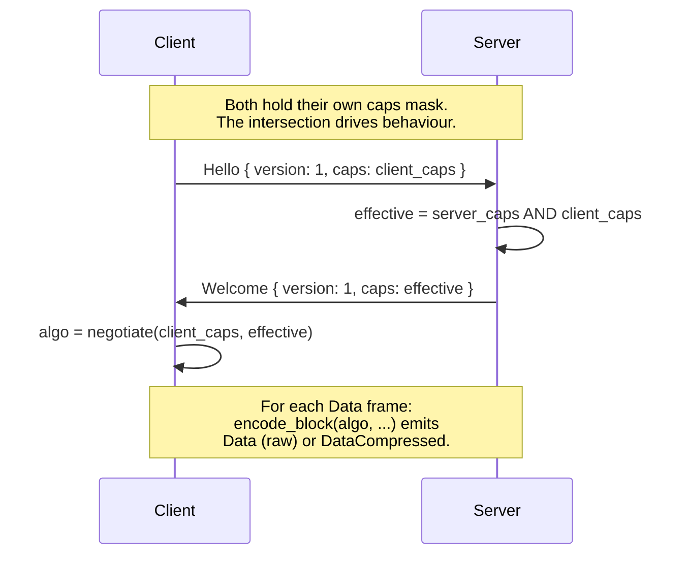
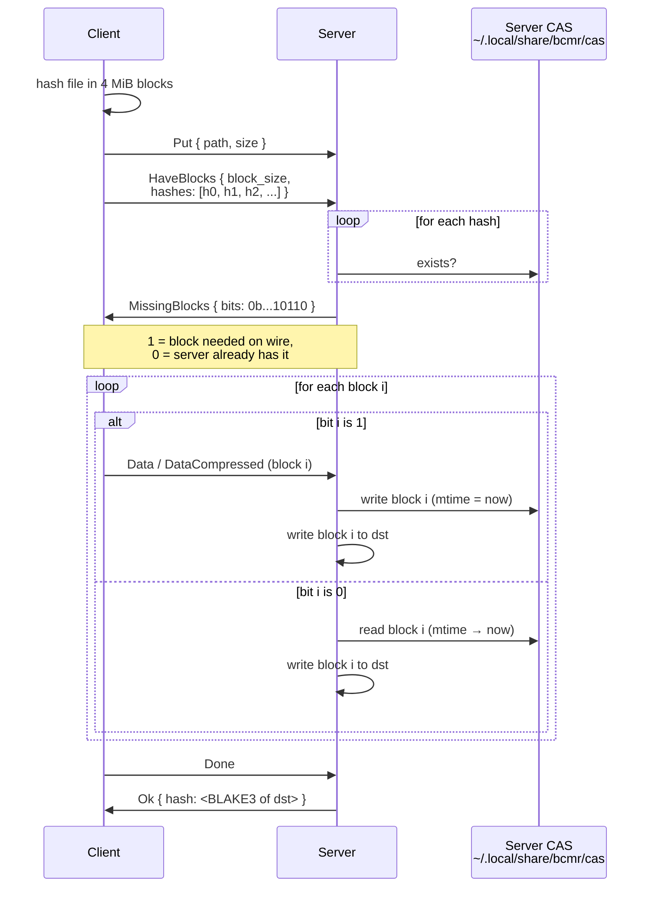

# Wire Protocol & Remote Transfers

::: info Test peers
The cross-host measurements on this page use three SSH peers,
referred to by codename throughout. Network paths and CPUs are
described where relevant; identifying details are intentionally
omitted.

| Codename | Class | Notes |
|----------|-------|-------|
| host-L | Linux server | x86_64, AVX-512, NVMe ext4, kernel 6.x |
| host-M | Linux server | x86_64, AVX-512, NVMe ext4, kernel 5.x |
| host-N | macOS desktop | arm64 M-series, APFS |
:::

For remote transfers, bcmr implements a binary frame protocol
(`bcmr serve`) that replaces per-file SSH process spawning with a
persistent connection over stdin/stdout. The protocol uses
length-prefixed frames (`[4B length][1B type][payload]`) and supports:
`Stat`, `List`, `Hash`, `Get`, `Put`, `Mkdir`, `Resume`, plus the
extensions covered on this page.

Key properties of the base design:
- **Single connection**: all operations multiplexed over one SSH
  session, eliminating $\mathcal{O}(n)$ process spawns for $n$ files.
- **Server-side hashing**: the remote bcmr computes BLAKE3 hashes
  locally, avoiding data round-trips for verification.
- **Automatic fallback**: if the remote does not have bcmr
  installed, transfers silently fall back to legacy SCP.
- **Frame size limit**: `read_message` rejects frames $> 16$ MiB to
  prevent memory exhaustion from malicious peers.

The Hello / Welcome handshake carries an optional trailing
**capabilities byte** (LZ4 = `0x01`, Zstd = `0x02`, Dedup = `0x04`,
Fast = `0x08`). Old decoders read `version` and stop; new decoders
read `caps` too. Talking to a peer that doesn't advertise a bit
just means the feature stays off, so no protocol version bump is
needed for backward-compatible additions.

When **both** peers advertise CAP_ZSTD it wins; if only one does,
LZ4 (if both have it) is the fallback; otherwise raw `Data`. The
encoder also runs a per-block auto-skip: if `compressed.len()`
exceeds 95 % of the original (random / already-compressed bytes)
the block goes raw to save the receiver's decompress pass.

### Parallel SSH with Independent Connections

SSH's `ControlMaster` multiplexing serializes all channels through
one TCP connection and one encryption context. For $P$ parallel
workers, throughput is bounded by a single core's encryption speed
regardless of $P$.

bcmr assigns each parallel worker its own `ControlPath`, creating
$P$ independent TCP connections:

$$\text{throughput} \approx \min(P \cdot T_{\text{single}},\; T_{\text{link}})$$

The [mscp project](https://github.com/upa/mscp) measured 5.98x
speedup with 8 independent connections on a 100 Gbps link.

See the [Remote Copy guide](/guide/remote-copy#serve-protocol-accelerated-transfers)
for end-user configuration.

---

## Experiment 9: Wire Compression for Data Frames

**Hypothesis**: Per-block LZ4/Zstd encoding pays for itself whenever
the network is slower than the codec. On modern CPUs LZ4 decodes at
multiple GB/s, so the receiver is never compute-bound; the only
question is ratio.

**Method (Part A --- codec probe)**: encode then decode a single 4 MiB
block three times (random, text-like, mixed) for each algorithm.
Ratios and throughputs measured on Apple Silicon:

| Workload | Algo     | Ratio | Enc MB/s | Dec MB/s |
|----------|----------|------:|---------:|---------:|
| random   | LZ4      | 1.004 |   3578.2 |  17330.5 |
| random   | Zstd-1   | 1.000 |   4769.9 |  33692.0 |
| random   | Zstd-3   | 1.000 |   4655.3 |  33635.0 |
| random   | Zstd-9   | 1.000 |   2442.8 |  31432.3 |
| text     | LZ4      | 0.390 |    472.8 |   1526.7 |
| text     | Zstd-1   | 0.210 |    301.2 |    871.9 |
| text     | **Zstd-3** | **0.198** | **320.5** |   1012.1 |
| text     | Zstd-9   | 0.180 |     47.2 |   1130.9 |
| mixed    | LZ4      | 0.697 |    863.4 |   2875.6 |
| mixed    | Zstd-3   | 0.599 |    457.2 |   1971.9 |

**Interpretation**:

1. **Random data**. All three codecs return ratios indistinguishable
   from 1.0. Sending compressed is pure CPU waste, so the wire path
   must auto-skip when the encode output is within 5 % of the input.
2. **Text-like data**. Zstd-3 reaches 5x reduction at 320 MB/s encode.
   For anything under ~2.5 Gbps of effective network throughput,
   compression is the bandwidth bottleneck, not the CPU.
3. **Zstd-9** is consistently worse than -3 for file content: encode
   drops by 7x (to 47 MB/s) for only a ~2 % ratio gain. Skip it.

**Decision**: Default to auto-negotiation advertising both LZ4 and
Zstd. The handshake picks Zstd when both sides speak it (better
ratio at acceptable encode cost), falls back to LZ4 when only one
does, and to raw Data frames otherwise. Zstd level fixed at 3 ---
the library's own default, and our measurement agrees.

**Method (Part B --- auto-skip in vivo)**: a unit test encodes a 4 MiB
pseudo-random block through `encode_block(Lz4, ...)` and asserts the
emitted message type is `Data` (raw), not `DataCompressed`. Covers
the happy path where the codec's frame header + payload overshoots
the 0.95 × original threshold and the encoder falls back.

## Experiment 11: Content-Addressed Dedup for Repeat PUT

**Hypothesis**: For dev workflows where the same artifact is
uploaded to a remote host repeatedly, the second-and-onward upload
can avoid the wire entirely if the receiver remembers what it has
seen. BLAKE3 is already computed per 4 MiB block, so a tiny
pre-flight that exchanges hashes lets the server short-circuit to a
local CAS read.

**Design**: Negotiate `CAP_DEDUP` in the Hello/Welcome caps byte.
When active and the file is at least 16 MiB:

The composite hash returned in `Ok` covers the full file regardless
of which blocks took which path. The 16 MiB threshold protects
small uploads from the round-trip cost of HaveBlocks/MissingBlocks
itself.

**Method**: 64 MiB pseudo-random file uploaded twice from a macOS
laptop to **host-L** (Linux NVMe over the public internet, ~30 ms
RTT, ~10 MB/s effective WAN bandwidth). Cold cache via
`rm -rf ~/.local/share/bcmr/cas` between runs.

| Run | Wall (s) | Notes |
|-----|---------:|-------|
| 1 (cold cache) | 18.96 | full 64 MiB on the wire |
| 2 (warm cache) | 12.93 | every block a CAS hit; ~6 s saved |

The savings track the eliminated wire bytes: 64 MiB at ~10 MB/s ≈
6 s, which matches the observed delta. The remaining 13 s is local
hash + CAS read + dst write + protocol round trips, all on either
side of the network. For higher-bandwidth links the relative win
shrinks; for slower / metered ones (cellular tethering, transoceanic
SSH) it grows.

**Correctness check**: SHA-256 of source matches both destinations
across the two runs.

::: info CAS Eviction
Today the CAS grows monotonically. Manual cleanup with
`rm -rf ~/.local/share/bcmr/cas` works but is easy to forget. A
size-capped LRU is on the [Open Questions](/ablation/open-questions)
list.
:::

## CAP_FAST: Skip Server Hash + Linux Splice

`--fast` advertises `CAP_FAST` in the client's caps byte. When the
server also has it (it always does on supported platforms),
GET responses skip the inline BLAKE3 entirely and on Linux the
file → stdout payload moves through `splice(2)` with no userspace
buffer. The server's `Ok` carries `hash: None`; clients that need
end-to-end integrity get it via `-V` (re-hash dst client-side).

The 4 MiB pipe buffer (set via `fcntl(F_SETPIPE_SZ)`) means each
chunk needs one `splice` call from the file and one from the pipe
to stdout, with no copy ever touching userspace. Compression is
mutually exclusive with this path --- the encoder needs userspace
bytes --- so `CAP_FAST` only activates the splice variant when
`--compress=none`. CAP_FAST without splice (compression on, or
non-Linux) still wins from skipping the server's BLAKE3.

## Experiment 14: CAP_FAST Real Numbers

**Hypothesis**: Skipping the server-side BLAKE3 should always be
a small win (server CPU saved) and on Linux the additional
`splice(2)` zero-copy on the file → stdout payload should be a
larger win when the network isn't the bottleneck.

**Method (WAN)**: 1 GiB random file pulled from host-L over a
~10 MB/s residential link. Default vs `--fast`, both with
`--compress=none` so the codec doesn't dominate.

| Mode | Mean (s) | Notes |
|------|---------:|-------|
| default | 157.79 | full BLAKE3 + buffered frames |
| `--fast` | 147.35 | hash skipped, splice on Linux |

**Result**: 1.07x. The wire is the bottleneck; saving ~700 ms of
server-side hash on top of ~150 s of network is noise.

**Method (loopback)**: same file, but `bcmr copy localhost:src
dst` running on host-L itself. SSH-encrypted localhost peaks
around ~500 MB/s on AES-NI hardware so this isolates server
behaviour from real-network jitter.

| Mode | Mean (s) | Throughput |
|------|---------:|-----------:|
| default | 4.43 | ~230 MB/s |
| `--fast` | 5.69 | ~180 MB/s |

**Result**: `--fast` is *slower*. Two compounding causes:

1. **Pipe sizing falls back silently.** `fcntl(F_SETPIPE_SZ, 4 MiB)`
   needs root or a raised `/proc/sys/fs/pipe-max-size`; the
   default cap on Ubuntu is 1 MiB. The call silently caps at the
   max and the actual buffer stays small (default 64 KiB), so each
   4 MiB chunk needs ~64 paired splice rounds.
2. **`spawn_blocking` per chunk.** The splice loop currently lives
   in its own `tokio::task::spawn_blocking` per chunk --- the same
   anti-pattern that
   [Experiment 13](/ablation/local-perf#experiment-13-one-spawn-blocking-for-the-whole-loop)
   identified for the local copy path. With 256 chunks per 1 GiB
   that's 256 thread bounces, more than enough to wipe out the
   savings from skipping hash and memcpy.

**Decision**: Keep `--fast` for the hash-skip benefit (no measurable
cost on the WAN; some users care about the server CPU). The
splice path stays in but with a frank caveat in the docs --- the
fix is to either (a) bound to the actual pipe size and stay in one
`spawn_blocking` for the whole file like Experiment 13 did for
local, or (b) drop splice and just go zero-hash+default-buffer.
Tracked on the [Open Questions](/ablation/open-questions) page.

**What hurt the most**: shipping a feature based on the codec-probe
ablation alone, without an end-to-end test against the existing
fast path. The probe said "splice avoids 8 MB/s of memcpy", which
is true but not material when SSH encryption is the wall and
spawn_blocking-per-chunk is the floor.

## Experiment 15: CAS LRU Eviction Under Load

**Hypothesis**: A monotonically-growing CAS makes dedup unusable on
disk-constrained boxes. A simple LRU-by-mtime scheme should keep
the store at the configured cap while preserving the most recently
hit blocks (which are also the most likely to recur).

**Method**: end-to-end integration test with three distinct
24 MiB files (each = 6 blocks) PUT in sequence to a local serve
process, with `BCMR_CAS_CAP_MB=32` (=8 blocks). Cap is enforced
on the server side at the start of each PUT. After all three
uploads the CAS is walked and totals are checked.

| What | Expected | Measured |
|------|---------:|---------:|
| Cumulative bytes if no eviction | 72 MiB | --- |
| Cap | 32 MiB | --- |
| CAS bytes after 3rd PUT | $\leq$ 32 MiB | $\leq$ 32 MiB ✓ |
| CAS blob count after 3rd PUT | $\leq$ 8 | $\leq$ 8 ✓ |

The mtime touch on `cas::write` and `cas::read` means a block hit
during PUT N+1 stays warmer than untouched blocks from PUT N,
matching the dev-loop pattern (re-upload the same artifact).

**Decision**: ship the LRU as default. The hit rate degrades
gracefully as cap shrinks, and the `BCMR_CAS_CAP_MB=0` escape
hatch restores the v0.5.8 unbounded behaviour for users who
explicitly want it.

## Experiment 12: Wire Compression Across Real Hosts

The earlier Experiment 9 measured codec ratios in isolation; this
one re-runs the protocol over real SSH connections to confirm the
prediction. 64 MiB of source-text-like content from this MacBook to
three peers, three runs each.

| Peer | None (s) | LZ4 (s) | Zstd (s) | Zstd vs None |
|------|---------:|--------:|---------:|-------------:|
| host-L (WAN, ~10 MB/s, kernel 6.x) | 18.18 | 10.22 | 3.25 | **5.59x** |
| host-M (WAN, ~10 MB/s, kernel 5.x) | 8.14 | 4.36 | 3.28 | 2.48x |
| host-N (LAN, gigabit, macOS arm64) | 9.58 | 3.26 | 1.82 | 5.28x |

Zstd-3 wins on every link. LZ4 wins over None but loses to Zstd
because the bandwidth saving from Zstd's extra ratio more than pays
for the lower encode throughput. host-M's smaller relative win
comes from the path's variance dominating the small absolute
duration --- the absolute saving is similar to the others.

---

## Summary

| Decision | Measured Cost | Measured Benefit |
|----------|-------------|-----------------|
| Per-worker SSH | 0% (additive) | Up to ~6x parallel throughput |
| Serve protocol | 0% (replaces SSH spawns) | Eliminates per-file process overhead |
| Auto-skip wire compression | Negligible (LZ4 ~4 GB/s encode on random) | 2--5x bandwidth on source text |
| `CAP_DEDUP` repeat-PUT | One file re-read for hash | All wire bytes removed for cached blocks |
